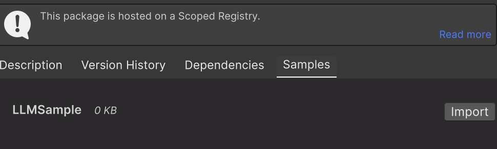
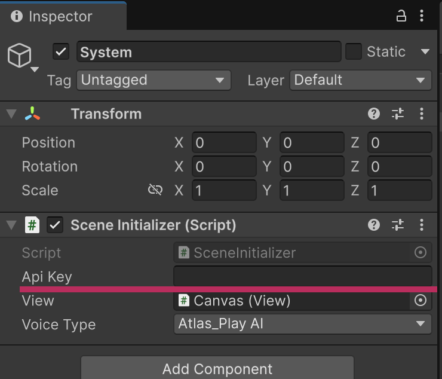

# Introduction

- This is Unity Package for using [Groq](https://groq.com/)

## Support Version
- Unity6.0 or later
- Groq v0.24.0 compatible

## ForJapanese
[こちら日本語ドキュメントです](/README_JP.md)


# Installation

This pacakge uses [UniTask](https://github.com/Cysharp/UniTask).
Please install UniTask before installing this package.

1. Open UnityPackageManager Window from tool menu
2. Select `Add packege from Git URL...`
3. Enter `https://github.com/Cysharp/UniTask.git?path=src/UniTask/Assets/Plugins/UniTask` to add UniTask
4. Re-select `Add packege from Git URL...`
3. Enter `https://github.com/Graffity-X/UnityGroq.git?path=package` to install Groq package


# About Samples
1. Open UnityPackageManager Window from tool menu
2. Select Graffity.Groq
3. Select Sample Tab
4. Press import button in the sample list<br> 


## LLMSample
- Basic function of this package.
- Texts in TextInput will send to LLM and Answer will be displayed.

## ModelDetailSample
- Api for getting information of models used in Groq.

## SpeechSample
- Speech to Text sample
- Use microphone to recording
- wav file will be send to Groq as a input.

## TextToSpeechSample
- TTS sample
- You can select voice type and set message

## FileApiSample
- File operation sample
- This apis are mainly used with batch mode
	- Note: Batch mode is not supported in this package.

## About Api key
Please set the api key on the serialize field of SceneInitializer on GameObject "System".<br>


# For Dev

## Directory structure

```
.
├── Dev-UnityGroq
│     ├── Assembly-CSharp-Editor.csproj
│     ├── Assembly-CSharp.csproj
│     └── Assets
│           ├── Graffity.Groq
│           └── Graffity.Groq.meta
├── package
│     ├── CHANGELOG.md
│     ├── CHANGELOG.md.meta
│     ├── LICENSE
│     ├── LICENSE.meta
│     ├── package.json
│     ├── package.json.meta
│     ├── README.md
│     ├── README.md.meta
│     ├── Runtime
│     │     ├── Api
│     │     ├── Api.meta
│     │     ├── Common
│     │     ├── Common.meta
│     │     ├── interfaces
│     │     ├── interfaces.meta
│     │     ├── Unity.Groq.asmdef
│     │     └── Unity.Groq.asmdef.meta
│     ├── Runtime.meta
│     └── Samples~
│         ├── ApiSample
│         └── ApiSample.meta
└── README.md
```

| Directory Name | description |
| :- | :- |
| Dev-UnityGroq | UnityProject.<br> This project is used for updating package, check for the sample behaviours . |
| Dev-UnityGroq/Assets/Graffity.Groq | Symbolic link of package.<br> |
| package | Directory for distribution as a Unity Package. |
