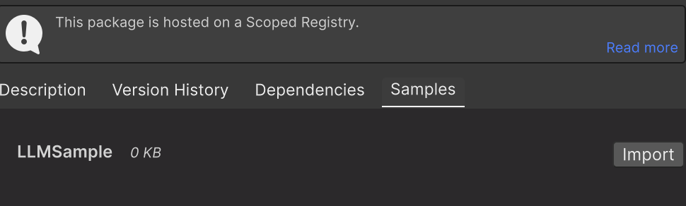

# Introduction

- [Groq](https://groq.com/) をUnityで利用するためのライブラリです

## Support Version
- Unity6.0 or later
- Groq v0.24.0 compatible

# Installation

本パッケージは [UniTask](https://github.com/Cysharp/UniTask) を利用しています。<br>
そのため、本パッケージを導入前に必ずUniTask を導入しておいてからご利用ください。


1. Unity上部のMenuバーより Tool -> PackageManager と選択して  Windowを開きます
2. 左上の `Add packege from Git URL...` を選択
3. `https://github.com/Cysharp/UniTask.git?path=src/UniTask/Assets/Plugins/UniTask` と入力してUniTaskを導入
4. 再度、左上の `Add packege from Git URL...` を選択
3. `https://github.com/Graffity-X/UnityGroq.git?path=package` と入力し本パッケージを導入


# Sampleについて
1. OUnity上部のMenuバーより Tool -> PackageManager と選択して  Windowを開きます
2. 本パッケージ Graffity.Groq を選択
3. 右側の情報のSample タブを選択
4. List に表示されているImport ボタンを押すと導入可能<br> 


## LLMSample
- LLM の基本的な動き確認用サンプルです
- TextInput で入力したものをLLMに投げ、返答は中央のText表示エリアに出力されます

## ModelDetailSample
- Groq で利用されてるModel 情報取得API関連のサンプルです.

## SpeechSample
- Speech to Text のSampleです. (いわゆる文字起こし)
- マイクを使って録音するため、事前にMic 利用の権限設定が必要です
- 入力としてはwavファイルになるため、一度録音データをWavファイルにしてからGroq 側に送信しています

## TextToSpeechSample
- Text to Speech のサンプルです
- SerializeField でVoice タイプを設定できます
- TextInput で入力された文章の読み上げをします
	- 現在では英語のみ対応

## FileApiSample
- ファイル操作系APIサンプルです
- 主にBatchMode と併用して使います
	- 本パッケージではBatchModeは非対応なので基本的には使うことは少ないです


## ApiKey の設定方法
各サンプルSceneのSystemオブジェクトに設定されているSceneInitializerコンポーネントの<br>
ApiKey という名前のフィールドに設定してください.<br>


# For Dev

## Directory structure

```
.
├── Dev-UnityGroq
│     ├── Assembly-CSharp-Editor.csproj
│     ├── Assembly-CSharp.csproj
│     └── Assets
│           ├── Graffity.Groq
│           └── Graffity.Groq.meta
├── package
│     ├── CHANGELOG.md
│     ├── CHANGELOG.md.meta
│     ├── LICENSE
│     ├── LICENSE.meta
│     ├── package.json
│     ├── package.json.meta
│     ├── README.md
│     ├── README.md.meta
│     ├── Runtime
│     │     ├── Api
│     │     ├── Api.meta
│     │     ├── Common
│     │     ├── Common.meta
│     │     ├── interfaces
│     │     ├── interfaces.meta
│     │     ├── Unity.Groq.asmdef
│     │     └── Unity.Groq.asmdef.meta
│     ├── Runtime.meta
│     └── Samples~
│         ├── ApiSample
│         └── ApiSample.meta
└── README.md
```

| Directory Name | description |
| :- | :- |
| Dev-UnityGroq | 開発用UnityProject.<br> 機能更新やSample の挙動チェック等で利用します |
| Dev-UnityGroq/Assets/Graffity.Groq | 配布パッケージのSymbolic linkです。<br>Sample~はUnityで読み込めないためSamples~以下を個別にSymbolic linkで読み込ませています |
| package | Unity Pacakge として配布するデータ置き場です |
